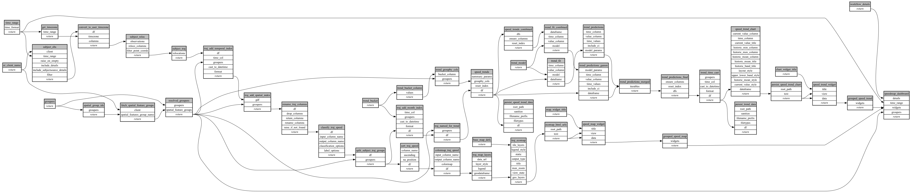

```
# AUTOGENERATED BY ECOSCOPE-WORKFLOWS; see fingerprint in README.md for details

```

```yaml
# fingerprint:
artifacts_sha256_basic: 3192902cae51104629cd7ba6cccd5b2c8a037061c182f3f23dac7bc0a09b4059
artifacts_sha256_strict: 9ca554749d0c2477091b2fae42fb0415e4eda5399b6062d0f1e776e0e6bcda25
installed_requirements:
- channel: https://repo.prefix.dev/ecoscope-workflows/
  name: ecoscope-platform
  version: {version: ==2.23.0}
- channel: conda-forge
  name: pydeck
  version: {version: ==0.9.2}
params_sha256: bada4236600cdd9a591ee3210e97e844ad72a9b04773c7bf318e1379fc2af615
spec_sha256: f1afb7370ce32603af2747d484c823e8ea342dfaff06a1340d4c445fec69652d

```

# ecoscope-workflows-speedmap-workflow


