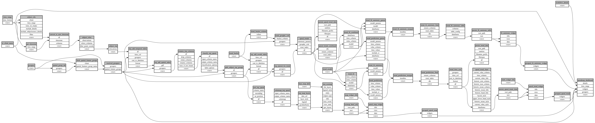

```
# AUTOGENERATED BY ECOSCOPE-WORKFLOWS; see fingerprint in README.md for details

```

```yaml
# fingerprint:
artifacts_sha256_basic: 5c5279ecf4489c1afb96cd88657842dc7e2b4b301804dd7e22d48dd31990fc69
artifacts_sha256_strict: 0f3d651ed8502ebbb49b03aa83af76bf4d77a1f98352e538e927802e69e4049d
installed_requirements:
- channel: https://repo.prefix.dev/ecoscope-workflows/
  name: ecoscope-platform
  version: {version: ==2.25.3}
- channel: conda-forge
  name: arviz
  version: {version: ==1.3.0}
- channel: conda-forge
  name: arviz-plots
  version: {version: ==1.3.2}
- channel: conda-forge
  name: bambi
  version: {version: ==0.21.0}
- channel: conda-forge
  name: pymc
  version: {version: ==6.3.1}
params_sha256: 07182b2688381cee4820aba0727058b8270a2a6f653bc283c1d031fb391a808a
spec_sha256: 6db3a015836a663febf849b1bc88007bedcc3cf73e8264d299ddcd9a77654a31

```

# ecoscope-workflows-speedmap-workflow


