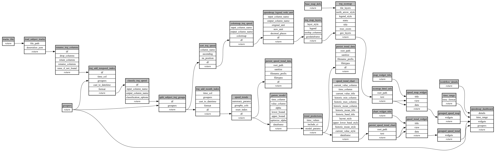

```
# AUTOGENERATED BY ECOSCOPE-WORKFLOWS; see fingerprint in README.md for details

```

```yaml
# fingerprint:
artifacts_sha256_basic: 1d78c9ac5e00a2f272eeaabaedf35ba007c6c922e0c67342ad473f18808d5ca0
artifacts_sha256_strict: fd18b142652b18f3a2ddbf54a74dcfeb5922a443fb8a0ff1d68df019c89622da
installed_requirements:
- channel: https://repo.prefix.dev/ecoscope-workflows/
  name: ecoscope-workflows-core
  version: {version: ==0.22.18}
- channel: https://repo.prefix.dev/ecoscope-workflows/
  name: ecoscope-workflows-ext-ecoscope
  version: {version: ==0.22.18}
- channel: https://repo.prefix.dev/ecoscope-workflows-custom/
  name: ecoscope-workflows-ext-custom
  version: {version: ==0.0.41}
- channel: https://repo.prefix.dev/ecoscope-workflows-custom/
  name: ecoscope-workflows-ext-speedmap-trend
  version: {version: ==0.0.1}
params_sha256: d712d8cb35b4d79b5503f58b978bd18d722ce6be245e3565e6d2a03f10f48c05
spec_sha256: 52305ff50d778dc5ab2cebed086a593710516264d7b0f4a5080f4cb64d2c7495

```

# ecoscope-workflows-speedmap-workflow


